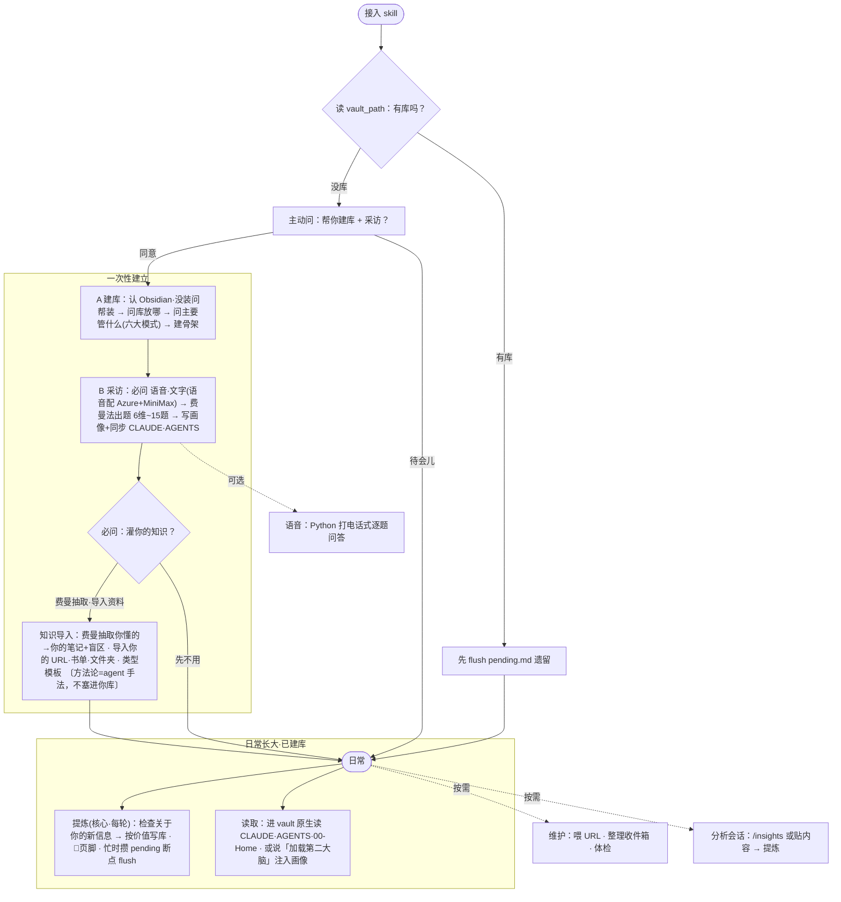

# second-brain-obsidian

> 把「**你是谁**（人格画像）+ **你知道什么**（知识库）」沉淀进 Obsidian，让任何 AI agent 用**你的风格 + 你的知识**做事——越用越像你。

一个 **agent-native** 的「第二大脑」skill：vault 是 Obsidian markdown、由 agent 直接读写。**提示词驱动 · 零依赖**——建库 / 采访 / 提炼 / 维护全由 agent 在对话里直接完成，**不装 hook、不跑后台进程**；**只有可选的语音问答用 Python**。三家 agent（**Claude Code / Codex / Hermes**）共用同一份 vault。

落地页：<https://second-brain-obsidian.pages.dev>

## 它能做什么

- **人格画像 + 知识库 → 一份 Obsidian vault**：6 维度画像 + 四层（Inputs/Process/Outputs/Feedback）× 六大工作模式 的知识结构，agent 直接读写 markdown。
- **跨 agent 通用**：Claude Code 原生读 `CLAUDE.md`、Codex / Hermes 读 `AGENTS.md`（同内容），共用同一份 vault、互不冲突。
- **在场提炼**（提示词驱动）：agent 把关于你的新信息提炼进 vault——**每条回复带个 `🧠` 页脚告诉你"记了啥 / 待提炼几条"**（漏了一眼看得见），忙复杂任务时先攒、到段落收尾再写。
  - **任何话题都收**（含项目、闲聊里关于你的真实信息）；明文密钥 / token 自动脱敏。
  - **纯本地、零外传**：只写你电脑里的 markdown，不上传任何东西、不注册任何系统 hook。
- **建库后快速起步**：不必干等慢慢提炼——agent 用**费曼法**帮你把你懂的 / 在学的快速记成**你自己的**知识笔记，或导入你的链接 / 书单 / 笔记。（费曼 / 切片这些方法论是 agent 的手法，不是往你库里塞的内容）
- **实时语音问答**（可选 · 唯一用 Python 处）：像打电话一样答采访题——Azure STT 听写 + MiniMax TTS 朗读（男 / 女声可选，默认女声）。

## 快速开始

1. 装好 skill（落地页有邀请码 + 一键安装脚本）。
2. 在 agent 里说 **「初始化第二大脑」** → agent 会：建 vault → 人格问答（文字或语音）写画像。
3. 之后正常聊天即可——agent **每轮都会把关于你的新信息在场提炼进库**。任何项目里说 **「加载第二大脑」** 就能调用你的画像 + 知识。

常用：喂资料「收录这个链接」/「整理收件箱」/「体检知识库」；想手动补全说「更新第二大脑」。

## 全流程一图

> 接入 → 一次性建立（建库 / 采访 / 灌**你的**知识）→ 日常长大（每轮提炼）；按需 / 可选走虚线。



## 提炼怎么发生（提示词驱动 · 无 hook）

第二大脑的「长大」靠 agent 在对话里**自检 + 页脚留痕**：每条回复结尾带 `🧠 第二大脑：记了X / 待提炼N条 / 本轮无新增`，让你**每轮看得见**有没有在记；发现关于你的新画像 / 决策 / 知识 / 项目 → 按 `references/vault-format.md` 写进 vault（判层 + 模式、去重合并、同步 `CLAUDE.md`/`AGENTS.md` + 索引）。忙时先攒进 `pending.md`、到断点再写。

- **不装任何系统 hook、不跑后台进程**——纯靠 `SKILL.md` 里的提示词，所以三家 agent（Claude / Codex / Hermes）行为一致、零依赖。
- 深度回顾：Claude Code 用 `/insights` 生成会话报告 → agent 提炼入库；Codex / Hermes 把要提炼的内容贴给 agent 即可。

## 结构

```
SKILL.md                       # agent 编排指令（建库 / 采访 / 读取 / 在场提炼 / 知识维护）
references/                    # vault 写入规范 + 人格框架 + 安装配置 + 方法论工具箱(费曼/切片…) + 笔记模板
agents/openai.yaml             # Codex 清单
scripts/                       # 仅语音问答用（可选 · Python）
  keys.py / store.py           # 语音密钥（secrets.env, 600）+ 小工具
  voice/                       # 打电话式语音采集（bridge.py + web/index.html）
<vault>/                       # 你的第二大脑
  00-Home.md  用户画像.md  CLAUDE.md  AGENTS.md
  00-Inbox/  10-Inputs/ 20-Process/ 30-Outputs/ 40-Feedback/   # 四层下按需建中文工作模式子目录
  50-MOCs/  60-Domains/  70-Assets/  90-Archive/  _System/
```

## 隐私

核心全程本地：vault 在你机器上；**不注册任何系统 hook、不跑后台进程、不上传任何东西**；提炼在对话里直接完成，明文密钥 / token 自动脱敏、不写进库。语音密钥只存 `~/.second-brain-obsidian/secrets.env`（chmod 600），绝不进 vault / git / 页面。和 HelixMesh 无关——它只是下载本 skill 的平台。

设计细节见 [`docs/specs/`](docs/specs/)。
